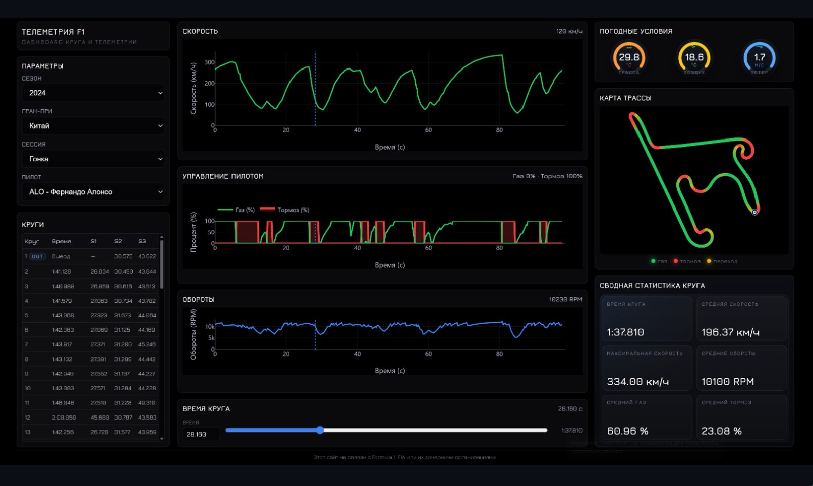

# Formula 1 Telemetry Dashboard

Educational full-stack web service for browsing and visualizing historical Formula-style racing telemetry.

The application lets a user select a season, grand prix, session, driver and lap, then view telemetry charts, a track map overlay and computed lap statistics in a dashboard interface.

## Technology stack

Backend:
- Python
- FastAPI
- SQLAlchemy
- PostgreSQL
- Pydantic
- FastF1

Frontend:
- HTML
- CSS
- JavaScript
- Plotly.js

Tools:
- Git / GitHub
- Docker Compose
- Swagger / OpenAPI

## Screenshots



## Features

- Hierarchical navigation: season -> grand prix -> session -> driver -> lap
- Historical racing telemetry visualization
- Speed and RPM charts
- Throttle and brake chart
- Time slider with synchronized cursor marker
- Track map overlay colored by acceleration, coasting and braking
- Lap summary statistics computed from telemetry
- REST API with Swagger / OpenAPI documentation
- PostgreSQL database with SQLAlchemy models
- Local PostgreSQL startup through Docker Compose

## Project structure

```text
telemetry_service/
├── .env.example
├── backend/
│   ├── main.py
│   ├── database.py
│   ├── models.py
│   ├── schemas.py
│   ├── crud.py
│   ├── seed_data.py
│   ├── update_data.py
│   └── routers/
│       ├── seasons.py
│       ├── races.py
│       ├── sessions.py
│       ├── drivers.py
│       ├── laps.py
│       └── telemetry.py
├── frontend/
│   ├── index.html
│   ├── style.css
│   └── app.js
├── docker-compose.yml
├── requirements.txt
└── README.md
```

## Database entities

- `Season`
- `GrandPrix`
- `Session`
- `Driver`
- `Lap`
- `TelemetryPoint`

The schema supports multiple seasons, races, sessions, drivers and laps.

## API endpoints

- `GET /health`
- `GET /seasons`
- `GET /races?season_id=`
- `GET /sessions?race_id=`
- `GET /session-detail?session_id=`
- `GET /drivers?session_id=`
- `GET /laps?session_id=&driver_id=`
- `GET /telemetry?lap_id=`
- `GET /lap-detail?lap_id=`
- `GET /lap-summary?lap_id=`
- `POST /session-metadata-warmup?session_id=`
- `POST /session-telemetry-warmup?session_id=`

## Data source and demo data

The seed script rebuilds the active PostgreSQL database and imports available historical racing seasons through FastF1.

By default, `backend.seed_data` detects supported seasons starting from 2018 and imports completed events. Session metadata and lap telemetry are loaded and cached when needed, so the project can start with season and event data and hydrate detailed telemetry during use.

Telemetry points for a selected lap are loaded from FastF1 when available. If live telemetry cannot be loaded, the application falls back to generated demo telemetry so the dashboard remains usable for educational demonstration.

## Setup instructions

### 1. Create and activate a virtual environment

Windows PowerShell:

```powershell
py -3 -m venv .venv
.venv\Scripts\Activate.ps1
```

### 2. Install dependencies

```powershell
py -3 -m pip install -r requirements.txt
```

### 3. Configure environment variables

Copy `.env.example` to `.env`:

```powershell
Copy-Item .env.example .env
```

Default local values:

```env
POSTGRES_HOST=localhost
POSTGRES_PORT=5432
POSTGRES_DB=telemetry_service
POSTGRES_USER=telemetry
POSTGRES_PASSWORD=telemetry
```

You can also configure the database with `DATABASE_URL`.

### 4. Start PostgreSQL

Recommended local option:

```powershell
docker compose up -d postgres
```

### 5. Create tables and seed demo data

The seed script rebuilds the active PostgreSQL database.

```powershell
py -3 -m backend.seed_data
```

To refresh the project with newly completed race weekends without wiping the database:

```powershell
py -3 -m backend.update_data
```

To only add missing seasons, races and sessions:

```powershell
py -3 -m backend.update_data --skip-hydration
```

### 6. Start the FastAPI server

Run the command from the project root:

```powershell
uvicorn backend.main:app --reload
```

### 7. Open the dashboard

- Dashboard: `http://127.0.0.1:8000/`
- Swagger / OpenAPI docs: `http://127.0.0.1:8000/docs`

## What I practiced in this project

- Designing SQLAlchemy models and relationships for a relational database
- Working with PostgreSQL configuration through environment variables
- Building REST API endpoints with FastAPI
- Loading, processing and caching telemetry data
- Creating frontend visualizations with JavaScript and Plotly.js
- Running a local service with Docker Compose and Swagger / OpenAPI

